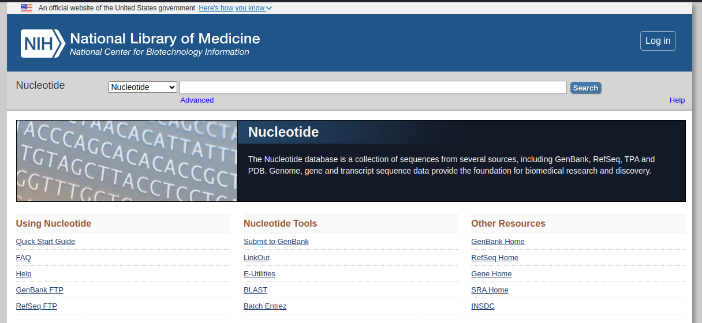
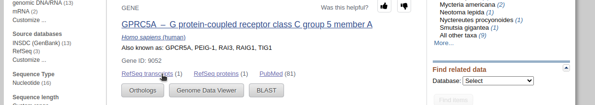
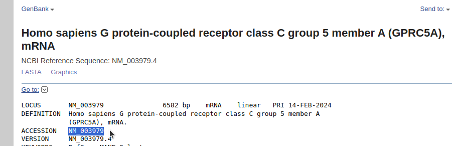

``` 
_____ _          
|_   _| |__   ___ 
  | | | '_ \ / _ \
  | | | | | |  __/
  |_| |_| |_|\___|
                  

 ____       _                       ____            _             
|  _ \ _ __(_)_ __ ___   ___ _ __  |  _ \  ___  ___(_) __ _ _ __  
| |_) | '__| | '_ ` _ \ / _ \ '__| | | | |/ _ \/ __| |/ _` | '_ \ 
|  __/| |  | | | | | | |  __/ |    | |_| |  __/\__ \ | (_| | | | |
|_|   |_|  |_|_| |_| |_|\___|_|    |____/ \___||___/_|\__, |_| |_|
                                                      |___/       

  ____              _ 
 / ___|_____      _| |
| |   / _ \ \ /\ / / |
| |__| (_) \ V  V /|_|
 \____\___/ \_/\_/ (_)
                      

  ____________________________________________________
| Primer design made easy - by a friendly talking cow! |
  ====================================================
                                                 \
                                                  \
                                                    ^__^
                                                    (oo)\_______
                                                    (__)\       )\/\
                                                        ||----w |
                                                        ||     ||
```
# The Primer Design Cow

## Description

**The Primer Design Cow** is a user-friendly Python-based application designed to streamline the process of primer design for PCR (Polymerase Chain Reaction) by offering an engaging and interactive experience for users by utilizing a fun talking cow with a text-to-speech component, which provides audio feedback to the user throughout the process.

### Features

1. **Fetch Gene Sequence Data**
   Retrieves gene sequence data as FASTA files from the NCBI database, using a gene accession number provided by the user. Also fetches gene summary data with useful information such as last date updated for the sequence to aid with reliability assessment of the sequence data.

2. **Calculate Potential Primers**
   Identifies potential primers in the 200 base pairs around the SNP of your choice, 100 upstream for the forward primer position and 100 downstream for the reverse primer position.

3. **Primer Criteria**
   Utilizes specific criteria for primer selection, including primer length, GC clamp, GC percentage, and more, ensuring the generation of high-quality primers suitable for PCR amplification.

4. **Melting Temperatures**
   Determines the melting temperatures of the potential primers for optimizing PCR conditions and ensuring primer specificity.

5. **Levenshtein Distance Algorithm**
   Prevents primer-dimer formation by calculating the similarity of the two potential primers' reverse compliments using an adaptation of the Levenshtein Distance Algorithm.

6. **Nucleotide Count**
   Analyzes the nucleotide composition of the primer sequences, providing insights into potential binding characteristics and primer performance.

7. **Primer Position Range**
   Calculates the precise position range of the primers within the gene sequence to aid in primer selection and assessment.

8. **Tabulated Primer Information**
   Visualizes primer details in a clear and organized tabulated format for both forward and reverse primers to aid in primer selection and assessment.

9. **Primer Selection**
   Allows for easy selection of optimal primer pairs from the tables, guided by comprehensive information on primer characteristics and suitability.

10. **Suitability Calculation**
    Determines the suitability of the selected primer pair based on predefined criteria detailed below, ensuring the generation efficient PCR products.

11. **Results Saving**
     Optionally Saves the results, including the primer tables and sequence data, to a file for future reference.


**Additional SNP Selection Criteria**
SNPs are only selectable such that the minimum band size after restriction digestion cleavage at the SNP site is 50 base pairs, ensuring reliable and discernible PCR products.

## Primer Selection Criteria 

### Primary Criteria

**As represented by the regular expression:** `^[GC][ATCG]{21,23}[GC]$`
* The primer length must be between 18 and 25 base pairs. 
* The primer must start with a GC clamp (a G or C base).
* The primer must also end with a G or C base.

### Additional Criteria and Calculations

* The primer's GC percentage must be between 40% and 60%.
`GC Percentage = (number of G's and C's / total number of nucleotides) * 100`

* calculates the melting temperatures of the potential primers
`Tm = 4 * (number of G's and C's) + 2 * (number of A's and T's)`

* calculates the similarity (how complimentary they are) of the two potential primers' using the Levenshtein distance algorithm after normalizing the distance value in order to prevent complimentary binding of the primers.
```
 levenshtein_distance_algorithm(forward, reverse):
    lev_distance = distance(reverse_complement(forward), reverse)
    similarity = (1 - (lev_distance / max(len(forward), len(reverse)))) * 100
    return similarity
```

* Presents the primer information in a tabulated format, including the primer number, sequence, length, GC percentage, nucleotide count, melting temperature, and position range in the gene sequence.
```
* Example Primer Table
╒═════════════════╤══════════════════════════╤═════════════════╤═════════════════╤══════════════════════════════════╤═══════════════════════╤═══════════════════════════════════╕
│   Primer Number │ Primer Sequence          │   Primer Length │   CG Percentage │ Nucleotide Count                 │   Melting Temperature │ Position Range in Gene Sequence   │
╞═════════════════╪══════════════════════════╪═════════════════╪═════════════════╪══════════════════════════════════╪═══════════════════════╪═══════════════════════════════════╡
│               1 │ CTTGGCACTAGGGTCCAGAATGGC │              24 │         58.3333 │ {'A': 5, 'C': 6, 'G': 8, 'T': 5} │                    76 │ 91-114                            │
├─────────────────┼──────────────────────────┼─────────────────┼─────────────────┼──────────────────────────────────┼───────────────────────┼───────────────────────────────────┤
```

* Users can select a forward and reverse primer from the tables.  
* The program will then calculate the suitability  of the selected primer pair making sure that the melting temperature difference is less than 5 degrees and provides feedback about the similarity of the selected primer pair.

_**The results, including the primer tables and sequence data, can be saved to a file for future reference.**_

## Installation

To begin using Primer Design Cow, simply install the required dependencies and follow the intuitive user interface. 

## Usage

* The program will prompt you to enter a gene accession number. Make sure you enter a valid number and press Enter.

```
  _________________________________________________
 /                                                 \
| Welcome to the primer design cow! Please enter a  |
| gene accession number to get started.             |
 \                                                 /
  =================================================
                                                 \
                                                  \
                                                    ^__^
                                                    (oo)\_______
                                                    (__)\       )\/\
                                                        ||----w |
                                                        ||     ||
Enter a Gene Accession Number:
```
* The program will fetch the gene summary data to allow you to confirm that the gene accession number you entered is indeed for the gene you are interested in. Entering an invalid gene accession number will cause the  program to raise a ValueError and IndexError and exit.

_**If the gene summary data is not for your intended gene, you can exit the program by Ctrl+C and try again with a different gene accession number.**_
* If the gene summary data is correct, the program will prompt you to pick a nucleotide position for your SNP then fetch the gene sequence data and calculate potential primers.

```
  _________________________________________________
 /                                                 \
| The gene is Homo sapiens G protein-coupled recept |
| or class C group 5 member A (GPRC5A), mRNA.       |
| It was last updated on 2023/12/17.                |
| It is 6582 nucleotides long.                      |
 \                                                 /
  =================================================
                                                 \
                                                  \
                                                    ^__^
                                                    (oo)\_______
                                                    (__)\       )\/\
                                                        ||----w |
                                                        ||     ||
  ______________________________________________
| Please pick a nucleotide position of interest. |
  ==============================================
                                              \
                                               \
                                                 ^__^
                                                 (oo)\_______
                                                 (__)\       )\/\
                                                     ||----w |
                                                     ||     ||
Enter a nucleotide position:
```
* It will then display the primer tables adn you will then be prompted to select a forward and reverse primer from the tables by entering their respective numbers as displayed on the table.
```
  _________________________________________________
 /                                                 \
| Please select a forward and reverse primer from t |
| he tables.                                        |
 \                                                 /
  =================================================
                                                 \
                                                  \
                                                    ^__^
                                                    (oo)\_______
                                                    (__)\       )\/\
                                                        ||----w |
                                                        ||     ||
Enter the index of the forward primer: 
Enter the index of the reverse primer:

```

* The program will assess the primer pair suitability and provide audio feedback throughout the process.
   
_**The program will continuously prompt you to select a forward and reverse primer from the tables until you select a suitable primer pair. If no pair is available exit the program by Ctrl+C and consider using a tool that allows for a wider range of primer selection around the SNP site.**_
* If the pair is suitable,you will be prompted to save the results. The results will be saved to two files in the project directory one for the primers and one for the gene sequence data.

```
  _________________________________________________
 /                                                 \
| The selected primers are suitable as a primer pai |
| r.                                                |
 \                                                 /
  =================================================
                                                 \
                                                  \
                                                    ^__^
                                                    (oo)\_______
                                                    (__)\       )\/\
                                                        ||----w |
                                                        ||     ||
  _________________________________
| Would you like to save the files? |
  =================================
                                 \
                                  \
                                    ^__^
                                    (oo)\_______
                                    (__)\       )\/\
                                        ||----w |
                                        ||     ||
Would you like to save the files? (y/n): y
  ____________
| Files saved. |
  ============
            \
             \
               ^__^
               (oo)\_______
               (__)\       )\/\
                   ||----w |
                   ||     ||

```
**Please note that this program requires an internet connection to fetch gene sequence data from the NCBI database and the espeak package to provide audio feedback.**

## Getting an accession number from NCBI

1. Go to the NCBI nucleotide database website (https://www.ncbi.nlm.nih.gov/nuccore).

2. Enter the gene name or keyword in the search bar and press Enter.

3. Select the gene of interest 's RefSeq transcripts page from the search results.

4. Copy the accession number from the gene's RefSeq transcripts page.
